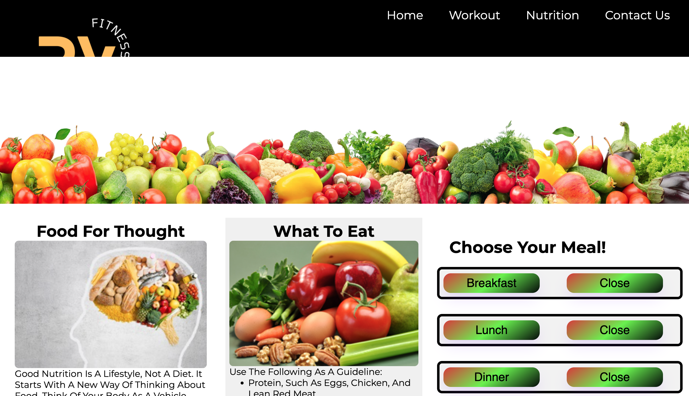
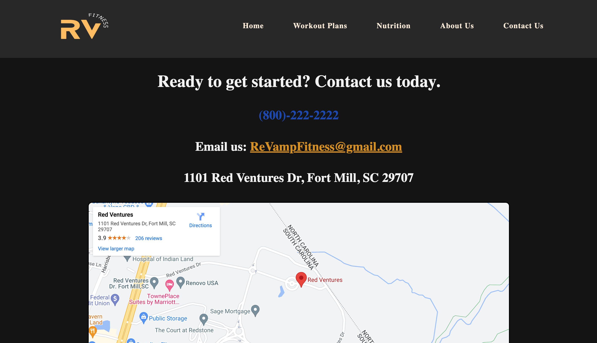

 # **ReVamp Fitness**
 We are aiming to tackle the health issues in the united states by creating a full-stack application that removes the barrier of entry to working out and improving one's health. In our application, we create workout plans based on the user's goals, using a inner API and third-party API.

## **Software Engineers / Creators**

- #### **Ismael V**
- #### **Dominic M**
- #### **Chris MP**
- #### **Jorge L**

## **Getting Started**
Clone and download this repo onto your local machine. Once you have done this, install the node packages. You can do this by running **```npm init```** on your comman line. After accepting, install the following dependencies **```npm i express mongoose mongodb body-parser```**.


In your terminal, run **```npm run nodemon```** this will start the server and app. Headover to your browser and type **```localhost:3000```** and ENJOY!
```
[nodemon] 2.0.18
[nodemon] to restart at any time, enter `rs`
[nodemon] watching path(s): *.*
[nodemon] watching extensions: js,mjs,json
[nodemon] starting `node app.js`
Example app listening on port 3000
```
## **Stopping the server / app**
To stop running the server and the app hit **```Control + C```** that should stop the server and app.

## **Built with**
* [HTML](https://developer.mozilla.org/en-US/docs/Learn/Getting_started_with_the_web/HTML_basics) - The Structure of webpage.
* [CSS](https://developer.mozilla.org/en-US/docs/Web/CSS) - Styleing of webpage.
* [MongoDB](https://www.mongodb.com/) - The document database used.
* [Mongoose](https://mongoosejs.com/docs/) - Object Data Modeling (ODM) library for MongoDB and Node.js.
* [API](https://www.programmableweb.com/api/exercisedb-rest-api-v10) - First Application Programming Interface used.
* [API2](https://rapidapi.com/justin-WFnsXH_t6/api/exercisedb/) - Second Application Programming Interface used.
* [API3](https://rapidapi.com/spoonacular/api/recipe-food-nutrition/) - Third application Programming Interface used.
* [Node.js](https://nodejs.org/en/) - The development for server.
* [Express.js](https://developer.mozilla.org/en-US/docs/Learn/Server-side/Express_Nodejs) - Used to create endpoints. 

---
### **_Home page_**


### **_Nutrition page_**


### **_Contact page_**


## **License**
This project is licensed under the MIT license - see the [LICENSE](../LICENSE) file for details.
